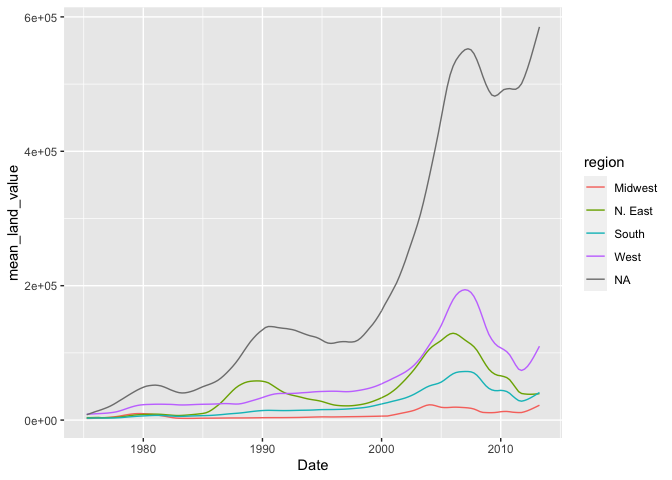

Assignment 4: Data transformation with dplyr and visualization with
ggplot
================

**Instructions: Please read through this before you begin**

  - This assignment is due by **10pm on Monday 10/19/20**.

  - For this assignment, please **reproduce this markdown file** using R
    markdown. This includes the followings:
    
      - **Reproduce this markdown template.** Pay attention to all the
        formatin gin this file, including bullet points, bolded
        characters, inserted code chunks, headings, text colors, blank
        lines, etc.
    
      - **Transform the data as instructed.** Try to use `tidyverse`
        functions even if you are more comfortable with base-R
        solutions.Show **the first 6** lines of the transformed data in
        a table through RMarkdown **using the kable() function**, as
        shown in this markdown file.
    
      - **Reproduce the plots exactly as shown in this html file.** In
        two cases where the plot is not shown (Excercises 3.7 and 3.9),
        generate plots that you think can best answer the question.
    
      - Have all your code embedded within the R markdown file, and show
        **BOTH yourcode and plots** in the knitted markdown file
    
      - When a verbal response is needed, answer by editing the part in
        the R markdwon template where it says “Write your response
        here”.
    
      - Use R Markdwon functionalities to **hide messages and warnings
        when needed**. (Suggestion: messages and warnings can often be
        informative and important, so please examine them carefully and
        only turn them off when you finish the exercise).

  - Please name your R markdown file `assignment_4.Rmd` and the knitted
    markdown file `assignmrent_4.md`. Plese push both files to your
    class GitHub repository.

First, load all the required packages with the following code. Install
them if they are not installed yet.

``` r
library(tidyverse)
library(knitr)
library(gapminder) #
```

**Exercise 1. Theopylline experiment**

This excercise uses the `Theoph` data frame (comes with your R
installation), which has 132 rows and 5 columns of data from an
experiment on the pharmacokinetics of the anti-asthmatic drug
theophylline. Tweleve subjects were given oral doses of theophylline
then serum concentrations were measured at 11 time points over the next
25 hours. You can learn more about this dataset by running `?Theoph`

Have a look at the data structure

``` r
kable(head(Theoph))
```

| Subject |   Wt | Dose | Time |  conc |
| :------ | ---: | ---: | ---: | ----: |
| 1       | 79.6 | 4.02 | 0.00 |  0.74 |
| 1       | 79.6 | 4.02 | 0.25 |  2.84 |
| 1       | 79.6 | 4.02 | 0.57 |  6.57 |
| 1       | 79.6 | 4.02 | 1.12 | 10.50 |
| 1       | 79.6 | 4.02 | 2.02 |  9.66 |
| 1       | 79.6 | 4.02 | 3.82 |  8.58 |

**1.1 Select columns that contain a lower case“t” in the `Theoph`
dataset. Do not mannually list all the columns to include.**

``` r
kable(head(Theoph %>% 
  select(Subject, Wt)))
```

| Subject |   Wt |
| :------ | ---: |
| 1       | 79.6 |
| 1       | 79.6 |
| 1       | 79.6 |
| 1       | 79.6 |
| 1       | 79.6 |
| 1       | 79.6 |

``` r
kable(head(select(Theoph, contains(('t'))))) # this selects the upper case T why?
```

| Subject |   Wt | Time |
| :------ | ---: | ---: |
| 1       | 79.6 | 0.00 |
| 1       | 79.6 | 0.25 |
| 1       | 79.6 | 0.57 |
| 1       | 79.6 | 1.12 |
| 1       | 79.6 | 2.02 |
| 1       | 79.6 | 3.82 |

**Rename the `Wt` column to `Weight` and `conc` column to
`Concentration` in the `Theoph` dataset.**

``` r
kable(head(Theoph %>% 
select(everything(), Weight = Wt, Concentration =conc)))
```

| Subject | Weight | Dose | Time | Concentration |
| :------ | -----: | ---: | ---: | ------------: |
| 1       |   79.6 | 4.02 | 0.00 |          0.74 |
| 1       |   79.6 | 4.02 | 0.25 |          2.84 |
| 1       |   79.6 | 4.02 | 0.57 |          6.57 |
| 1       |   79.6 | 4.02 | 1.12 |         10.50 |
| 1       |   79.6 | 4.02 | 2.02 |          9.66 |
| 1       |   79.6 | 4.02 | 3.82 |          8.58 |

**Extract the `Dose` greater than 4.5 and `Time` greater than the mean
`Time`.**

``` r
kable(head(Theoph %>% 
  filter(Dose > 4.5, Time > mean(Time))))
```

| Subject |   Wt | Dose |  Time | conc |
| :------ | ---: | ---: | ----: | ---: |
| 3       | 70.5 | 4.53 |  7.07 | 5.30 |
| 3       | 70.5 | 4.53 |  9.00 | 4.90 |
| 3       | 70.5 | 4.53 | 12.15 | 3.70 |
| 3       | 70.5 | 4.53 | 24.17 | 1.05 |
| 5       | 54.6 | 5.86 |  7.02 | 7.09 |
| 5       | 54.6 | 5.86 |  9.10 | 5.90 |

**1.4 Sort the `Theoph` dataset by `Wt` from smallest to largest and
secondarily by Time from largest to smallest**

``` r
kable(head(Theoph %>% 
  arrange(Wt, desc(Time))))
```

| Subject |   Wt | Dose |  Time | conc |
| :------ | ---: | ---: | ----: | ---: |
| 5       | 54.6 | 5.86 | 24.35 | 1.57 |
| 5       | 54.6 | 5.86 | 12.00 | 4.37 |
| 5       | 54.6 | 5.86 |  9.10 | 5.90 |
| 5       | 54.6 | 5.86 |  7.02 | 7.09 |
| 5       | 54.6 | 5.86 |  5.02 | 7.56 |
| 5       | 54.6 | 5.86 |  3.50 | 8.74 |

**1.5 Create a new column called `Quantity`that equals to`Wt` x `Dose`
in the `Theoph` dataset. This will tell you the absolute quantity of
drug administered to the subject (in mg). Replace the `Dose` Variable**

``` r
kable(head(Theoph %>% 
  mutate(Quantity=Wt*Dose) %>% 
  select(Subject,Quantity,Time, conc)))
```

| Subject | Quantity | Time |  conc |
| :------ | -------: | ---: | ----: |
| 1       |  319.992 | 0.00 |  0.74 |
| 1       |  319.992 | 0.25 |  2.84 |
| 1       |  319.992 | 0.57 |  6.57 |
| 1       |  319.992 | 1.12 | 10.50 |
| 1       |  319.992 | 2.02 |  9.66 |
| 1       |  319.992 | 3.82 |  8.58 |

**1.6 Find the mean `conc` and sum of the `Dose` received by each test
subject.**

Show data for the 6 subjects with the smallest sum of `Dose` as below
\*\* Do not define new intermediate objects for this excercise; use
pipes to chain together functions. \*\*

``` r
kable(head(Theoph %>% 
  group_by(Subject) %>% 
  summarize(mean(conc),sum(Dose)) %>% 
  arrange(`sum(Dose)`)))
```

    ## `summarise()` ungrouping output (override with `.groups` argument)

| Subject | mean(conc) | sum(Dose) |
| :------ | ---------: | --------: |
| 9       |   4.893636 |     34.10 |
| 6       |   3.525454 |     44.00 |
| 1       |   6.439091 |     44.22 |
| 2       |   4.823636 |     48.40 |
| 4       |   4.940000 |     48.40 |
| 8       |   4.271818 |     49.83 |

**Exercise 2. Trend in land value**

This exercise uses a dataset that describes the trend of land value
(`Land.Value`), among other variables in different states in the US
1975-2013.The states are grouped into four different regions, under the
variable `regon`. This dataset was obtained from the Data Science
Services of Harvard University.

``` r
housing <- read_csv("https://raw.githubusercontent.com/nt246/NTRES6940-data-science/master/datasets/landdata_states.csv")
```

    ## Parsed with column specification:
    ## cols(
    ##   State = col_character(),
    ##   region = col_character(),
    ##   Date = col_double(),
    ##   Home.Value = col_double(),
    ##   Structure.Cost = col_double(),
    ##   Land.Value = col_double(),
    ##   Land.Share..Pct. = col_double(),
    ##   Home.Price.Index = col_double(),
    ##   Land.Price.Index = col_double(),
    ##   Year = col_double(),
    ##   Qrtr = col_double()
    ## )

``` r
kable(head(housing)) 
```

| State | region |    Date | Home.Value | Structure.Cost | Land.Value | Land.Share..Pct. | Home.Price.Index | Land.Price.Index | Year | Qrtr |
| :---- | :----- | ------: | ---------: | -------------: | ---------: | ---------------: | ---------------: | ---------------: | ---: | ---: |
| AK    | West   | 2010.25 |     224952 |         160599 |      64352 |             28.6 |            1.481 |            1.552 | 2010 |    1 |
| AK    | West   | 2010.50 |     225511 |         160252 |      65259 |             28.9 |            1.484 |            1.576 | 2010 |    2 |
| AK    | West   | 2009.75 |     225820 |         163791 |      62029 |             27.5 |            1.486 |            1.494 | 2009 |    3 |
| AK    | West   | 2010.00 |     224994 |         161787 |      63207 |             28.1 |            1.481 |            1.524 | 2009 |    4 |
| AK    | West   | 2008.00 |     234590 |         155400 |      79190 |             33.8 |            1.544 |            1.885 | 2007 |    4 |
| AK    | West   | 2008.25 |     233714 |         157458 |      76256 |             32.6 |            1.538 |            1.817 | 2008 |    1 |

**2.1 Washington DC was not assigned to a region in this dataset.
According to the United States Census Bureau, however, DC is part of the
South region. Here:**

  - **Change the region of DC to “South” (Hint: there are multiple ways
    to do this, but `mutate()` and `ifelse()` might be helpful)**

  - **Save this updated `region` variable toghether with `state`, `Date`
    and `Land.Value` into a new data frame**

  - **Select the records from DC in this new data frame. How many
    records are there from DC? Show its first 6 lines.**

<!-- end list -->

``` r
South_Dc<- housing %>% 
filter(State == "DC") %>% 
  mutate(region="South") 
```

``` r
updated_housing <- select(South_Dc,region,State, Land.Value,Date)
dim(updated_housing)
```

    ## [1] 153   4

``` r
kable(head(updated_housing,6))
```

| region | State | Land.Value |    Date |
| :----- | :---- | ---------: | ------: |
| South  | DC    |     290522 | 2003.00 |
| South  | DC    |     305673 | 2003.25 |
| South  | DC    |     323078 | 2003.50 |
| South  | DC    |     342010 | 2003.75 |
| South  | DC    |     361999 | 2004.00 |
| South  | DC    |     382792 | 2004.25 |

Answer:Write your response here.

The number of records are 153

**2.2 Generate a dataframe that summarizes the mean land value of each
region at each time point.**

``` r
kable(head(housing %>% 
  group_by(region,Date) %>% 
summarize (mean_land_value = mean(Land.Value))))
```

    ## `summarise()` regrouping output by 'region' (override with `.groups` argument)

| region  |    Date | mean\_land\_value |
| :------ | ------: | ----------------: |
| Midwest | 1975.25 |          2452.167 |
| Midwest | 1975.50 |          2498.917 |
| Midwest | 1975.75 |          2608.167 |
| Midwest | 1976.00 |          2780.000 |
| Midwest | 1976.25 |          2967.333 |
| Midwest | 1976.50 |          3212.833 |

**2.3 Using the dataframe above, plot the trend in mean land value of
each region through time.**

``` r
housing %>% 
    group_by(region,Date) %>% 
summarize (mean_land_value = mean(Land.Value)) %>% 
  ggplot(mapping=aes(x=Date,y= mean_land_value, color = region))+
  geom_line()
```

    ## `summarise()` regrouping output by 'region' (override with `.groups` argument)

<!-- -->
